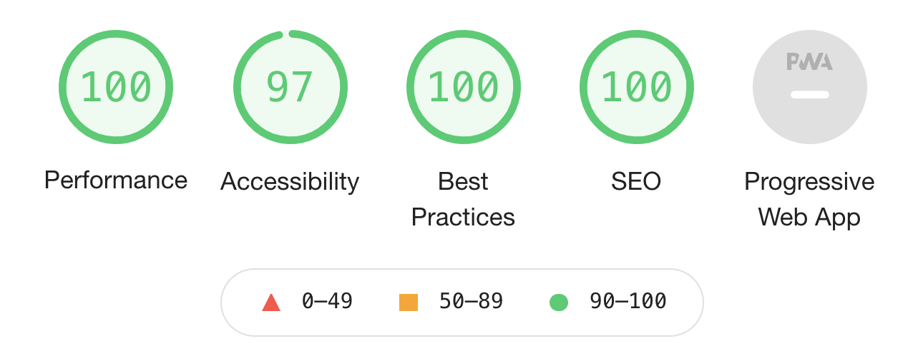

# Frontend Mentor - Interactive pricing component solution

## Table of contents

-   [Frontend Mentor - Interactive pricing component solution](#frontend-mentor---interactive-pricing-component-solution)
    -   [Table of contents](#table-of-contents)
    -   [Overview](#overview)
        -   [The challenge](#the-challenge)
        -   [Screenshot](#screenshot)
        -   [Links](#links)
    -   [My process](#my-process)
        -   [Built with](#built-with)
        -   [What I learned](#what-i-learned)
        -   [Testing](#testing)
            -   [Lighthouse Report](#lighthouse-report)
        -   [Continued development](#continued-development)
        -   [Useful resources](#useful-resources)
    -   [Acknowledgments](#acknowledgments)

## Overview

This is a solution to the [Interactive pricing component challenge on Frontend Mentor](https://www.frontendmentor.io/challenges/interactive-pricing-component-t0m8PIyY8). Frontend Mentor challenges help you improve your coding skills by building realistic projects.

### The challenge

Users should be able to:

-   View the optimal layout for the app depending on their device's screen size
-   See hover states for all interactive elements on the page
-   Use the slider and toggle to see prices for different page view numbers

### Screenshot

### Links

-   Solution URL: [Frontend Mentor Price Slider Solution](https://www.frontendmentor.io/solutions/interactive-pricing-component-CP7KeMA6v)

## My process

I planned the general layout by viewing the provided Figma wireframe. It seemed straightforward with one layout shift in mobile view. The position of the price element shifted from above the range slider on desktop, to below on mobile. I otherwise positioned the card elements with Flexbox. 
I had to read up on the styling input range and discovered it to be no easy task. I decided to customize the input range, to benefit from the default accessibility settings. 
I discovered that if you do not want the default styling of an input range then, there is no easy road to custom styling with cross-browser support. W3C had good documentation on this, except how to accomplish the slider's lower fill. I found a thread on Stack Overflow that solved this by using a 90-degree linear gradient based on the input value. 
The challenge is small in size, a landing page. I, therefore, decided to build the project with no build tools or framework, but instead use vanilla CSS and JavaScript.

### Built with

-   Semantic HTML5 markup
-   CSS custom properties
-   Flexbox
-   CSS Grid
-   JavaScript

### What I learned

The biggest challenge was to fill the lower range track on a user event. I found a thread on Stack Overflow that solved the task by setting a linear gradient dynamically.

### Testing

[W3 HTML Validation](https://validator.w3.org/nu/#textarea) with no errors. 

#### Lighthouse Report

 
A lower score on accessibility is due to low contrast in the horizontal ruler. This could be corrected by increasing the contrast, but I decided to follow the design specification for the challenge.

### Continued development

-   Internationalization 
    I took the opportunity to get familiar with CSS logical properties for this project. It would then be a natural continued development to internationalize the project to other languages and currencies.
-   Dark theme

### Useful resources

-   W3C
-   Stack Overflow

## Acknowledgments

A big thank you to the FM Slack channel and in particular Grace Snow, Alex Marshall and Arca. Grace and Alex aided me in troubleshooting accessibility concerns regarding labels wrapping input fields. The correct markup is to use a aria-label in this situation, and not sr-only or aria-labelledby. 
Arca assisted me in troubleshooting the display of the price when the slider was not moving. I called the calculateDiscount function in the eventlistener instead of the getPrice function. The calculateDiscount helper function is instead called in the getPrice function.
